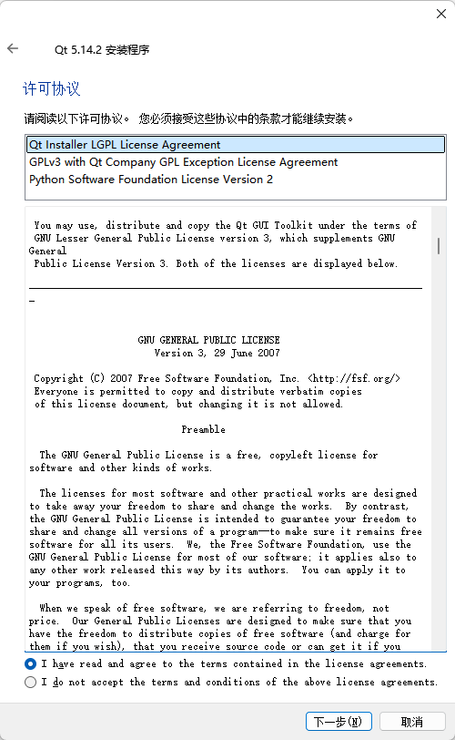
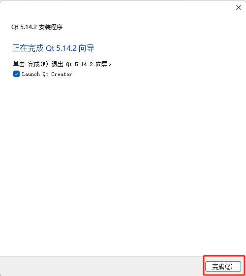

# <p class="hidden"> 开源项目： </p> AI理疗机器人

## 简介

AI理疗机器人融合现代智能医疗与康复医学，结合中医经络和现代生物力学，以AI深度学习复现大师推拿手法，可定制个性化方案。系统依红外热成像生成按摩轨迹，精准定位穴位痛点，突破传统瓶颈，为多场景提供智能方案。<br>
本项目提出具备人体生物力学自适应能力的系统，用高精度柔性驱动和临床大数据模型，实现毫米级定位、毫牛级施力控制，打破国外垄断，填补国内空白。<br>
它全场景智能适配，能在复杂电磁环境稳定运行；超精密控制，动作定位精度达0.05mm，动态施力控制±1N，实时反馈0.1ms级。支持AI算法远程迭代，提升康复效率30%-50%。<br>
睿尔曼AI理疗机器人将中医理疗数字化、标准化，解决传统痛点，融合AI与柔性技术，为多领域提供高效安全方案，模块化可扩展，推动医疗机器人普惠化。


<center>AI理疗机器人</center>

## 设计背景

睿尔曼AI理疗机器人是专为美容美体、中医理疗、养老等行业开发的理疗按摩机器人，机器人由主体、主控制器、机械臂、传感器集成、按摩工具、操控面板、电气系统等部分组成，
当前从事理疗保健的机构主存在着从业者严重不足、人员流动性大、专业性差、时间效率低、按摩理疗治疗无法保证等问题，应用睿尔曼AI理疗机器人有如下优势：

1. 机器人完全可以替代按摩师提供按摩服务，因此可以弥补按摩技师数量不足；
2. 提高按摩师的时间效率，一个按摩技师可以利用多个按摩机器人同时为多个客户服务提供标准化服务；
3. 机器人可以复刻按摩师的技法和手法，实现标准化服务，超过大多数按摩师的理疗水平；
4. 机器人可以持续提供长期稳定的按摩服务，解决人工流动性大的问题；
5. 拓展新的按摩技法更容易，按摩数据统计和分析帮助用户建立个人按摩档案。

## 硬件结构

相关硬件已开源，如需下载请参考[相关下载](#4329)。<br>

### 硬件简介

#### 产品构成

本产品如图所示主要由以下部分组成：机械臂、按摩头、视觉传感器、控制面板、电气和控制系统、机器人主体等。


#### 各部分功能描述

1. **可移动底盘**：
    - **移动转运设计**：为在室内平面上移动方便，以及进行短距离转运，跨越台阶等障碍，设计隐藏式把手，在需要搬运机器人时，只需要拉出2个把手，即可将机器人实现机器人搬运。
    - **物料仓设计**：物料仓可以存放2个按摩头。物料仓采用可拆卸外挂的形式，可以借用拉出的2个把手来进行固定，物料仓挂在机器人腰部的正面的位置。
    
    **主要技术参数**：
       - 尺寸（`长*宽*高`）：`≥525mm*430mm*1000mm`
       - 重量：50kg
       - 材质：钣金+塑料外壳
       - 按键：电源键、急停键
       - 灯带：蓝色
       - 移动轮：非动力轮
2. **主控制器**：
    
    <center>主控制器</center>

    主控模块是整个系统的控制中枢，主控制器选择 Nvidia Jetson XAVIER NX模组，该模组参数如下，十分适用于移动平台的视觉处理任务。
      - 预装Ubuntu18.04 系统
      - 6核Carmel架构@V8.2 64bit CPU
      - 384核Volta架构的GPU
      - 48个TensorCore
      - 可实现21TOPS的INT8运算能力
      - 尺寸仅`90mm*103mm*35mm`
3. **控制面板**：
    
    <center>控制面板</center>

    - 用户通过控制面板对按摩区域和功能进行选择和参数设定，从而执行按摩项目，包括腰部舒缓、腹腔推揉、背部推揉等多种按摩项目。
    - 控制面板部署在机器人的支架上，可以升降、旋转、翻折，便于技师进行多机位操作，同时控制面板可以取下，与机器人进行无线通信，支持顾客直接操作。
    **主要技术参数**：
       - 屏幕：12.3英寸
       - 分辨率：1920*1280
       - 运行内存：8GB LPDDR3
       - 存储容量：512G固态硬盘
       - 尺寸：`292*208.8*9.76mm`
       - 重量：约1.16kg
4. **RML63-6F机械臂**：
    
    <center>RML63-6F机械臂</center>

    - 机械臂作为按摩项目的执行主体，根据按摩工作范围和力道的要求，选择为睿尔曼RML63-6F机械臂，末端集成六维力传感器。
    - 协作机械臂集成视觉传感器和按摩头，控制线均为机械臂内走线；视觉传感器采用USB Type-c接口连接；按摩工具安装在机械臂末端。
    **主要技术参数**：
       - 自由度：6
       - 负载：3kg
       - 自重：约10kg
       - 工作半径：900mm
       - 重复定位精度：±0.05mm
       - 供电电压：DC20-30V，DC24V
       - 功耗：最大功耗≤200W，综合功耗≤100W
       - 防护等级：IP54（机械臂本体）

        机械臂更多详细参数请参考[RML63系列参数及D-H模型](https://develop.realman-robotics.com/robot/robotParameter/RML63OntologyParameters/)
5. **视觉传感器**：
    
    <center>视觉传感器</center>

    视觉传感器采用Intelrealsense D435型3D结构光相机，具备高精度、低功耗优势，可实时采集物体三维信息，适用于25-150cm距离的识别。用来识别按摩人员的体型特征。视觉采用一体化设计。
    **主要技术参数**：
      - 深度距离：0.25-1.5m
      - 功耗：平均功耗<2.5W，待机功耗<1.5W峰值功耗<5W，峰值电流小于1000mA
      - 深度图分辨率：
        - USB2.0模式：1280x800@7fps640x400@30fps；
        - USB3.0模式：1280x800@30fps；640x400@60fps
      - 精度：1m:±5mm
      - 深度视场角FOV：H67.9° V45.3°
      - 彩色视场角FOV：H71.5° V56.7° D84°
6. **推揉型按摩头**：
    
    <center>推揉型按摩头</center>

    - 按摩工具的按摩触点与按摩工具基座之间具备弹性，模仿手腕的柔性功能，以便于在进行按摩时，按摩工具可以灵活贴合皮肤，保持压力的持续稳定的输出。
    - 按摩头设计采用多点触头，设置4个按摩头；具备快插快换、即插即用的特点，应用方便。
    - 推揉型按摩头具备热敏温控功能，从而在按摩的过程中达到热疗的效果。按摩头的触点采用304不锈钢材质，强化热疗效果。
    **主要技术参数**：
       - 尺寸：Φ90*120mm
       - 重量：0.9kg
       - 按摩头尺寸：2cm
       - 按摩头材料：铝合金+ABS
       - 按摩头数量：4
7. **按压型按摩头**：
    
    <center>按压型按摩头</center>

    - 按压型按摩头具备人手的拇指、手掌等结构特征，按压型按摩头安装于机械臂末端，具备快插快换、即插即用的特点，应用方便。
    - 按压型按摩头具备热敏温控功能，从而在按摩的过程中达到热疗的效果。按摩头采用铝合金内形和硅胶外形，模仿人手的软硬程度，提高按摩的舒适度。
    - 在工作时，按压型按摩头可以利用拇指、手指关节、掌根等部位，配合机械臂的运动控制和力学控制，模仿医师的按摩手法。
    **主要技术参数**：
       - 尺寸：`115*80*50mm`
       - 重量：0.9kg
       - 按摩头尺寸：仿人拇指、手指关节、手掌根等特征
       - 按摩头材料：铝合金+ABS+硅胶
8. **电气系统**：
    
    <center>手持操作终端</center>

    - 电气系统具备电源开关和急停开关各1个，布置于移动底盘上，便于开机和危险急停；
    - 机器人配备手持操作终端，与机器人背面底部有线连接，在执行按摩项目时，顾客手持操作终端，方便调节高低档位（力道控制）和控制开始/暂停，以确保舒适和安全。
    - 机器人具备WIFI功能，通过WIFI功能，操作面板与机器人主控单元通信，从而进行交互控制；机器人通过WIFI功能，可以连接客户的局域网，从而为后续对接客户管理平台的数据对接进行功能预留。
    - 机器人配备对外接口，包括千兆网口1个，USB3.0接口4个，HDMI接口1个，DP接口1个，接口布置在机器人外壳上，外覆装饰罩，便于打开，方便接口使用。

### BOM

大健康机器人的BOM信息，请参考获取的开源文件中`Hardware > BOM`路径下的**01-大健康机器人3.0-（主体）BOM**和**02-大健康机器人3.0-（按摩头）BOM**文件，确保按需完成相关材料的采购和收集。

#### 整体模型

大健康机器人的三维模型图，请参考获取的开源文件中的 **大健康3.0** 文件，大健康的外观尺寸，如下图所示。

#### 部件加工

根据大健康机器人的部位和加工工艺不同可分为本体部分和按摩头两部分以及机加、钣金和手板三种工艺。<br>
大健康机器人整体按照各个零部件的部位和加工工艺不同，可拆分为各部件的三维模型图和CAD图纸，便于进行加工生产，具体请参考开源文件中的`Hardware > CAD`路径下的`01 本体部分`和`02 按摩头部分`中的相关文件。

### 组装流程

参照BOM以及各部件的模型图纸完成各部件的加工和采购后，请参考开源文件中`Hardware > Assembly Process`路径下的各部件装配流程，完成大健康机器人的硬件整体组装。

注意：关于大健康机器人按摩臂的线束定义，可参考`Hardware > Harness Definition`路径下的**大健康按摩臂线束定义图**中定义说明。

## 软件资源

目前已开源软件代码，请访问[相关下载](#4329)下载，后续会持续升级更新。<br>

### 安装对应的python环境

#### 安装conda

##### 配套版本要求

- **操作系统**：Ubuntu 20.04.6 LTS（代号“focal”）
- **系统架构**：aarch64
- **Anaconda 版本**：23.7.4

##### 安装conda环境

已完成Anaconda3-2023.09-0-Linux-aarch64.sh安装包获取和上传。

1. 执行以下命令，安装Anaconda。

    ```bash
    bash Anaconda3-2023.09-0-Linux-aarch64.sh
    ```

    指令执行结果：
    

2. 请阅读安装协议，可通过键入“Enter”键进行翻页，当出现 **Do you accept the license terms? [yes|no]** 时，表示协议阅读完毕，输入`yes`同意安装协议并继续安装，如下图所示。

    

3. 根据提示确认安装位置，本文以默认安装位置为例，键入“Enter”键，确认安装位置，如下图所示。

    

4. 当窗口显示如下信息是，请根据提示输入`yes`，完成初始化Anaconda（包含环境变量的设置），如下图所示:
   

::: tip 说明

**PS：Anaconda安装完成以后出现的提示解读**。<br>
For changes to take effect, close and re-open your current shell.，翻译过来就是：关闭当前命令行，并重新打开，刚刚安装和初始化Anaconda设置才可以生效，重新打开一个命令行后直接就进入了conda的base环境。
:::

#### 离线安装预配置的 Conda 环境

请先将conda环境压缩包rm.tar.gz拷贝到目标机器上。


大健康程序运行需要特定的Python包环境。为方便部署，我们已将所需的conda环境打包成压缩文件，您只需按以下步骤在新的开发板上安装即可。

1. 执行以下命令，创建目标环境目录。

   ```bash
   mkdir -p ~/anaconda3/envs/rm  # 创建环境目录rm，请确认conda安装路径正确
   ```

2. 执行以下命令，解压环境备份文件，并将传输过来的 rm.tar.gz 解压到新环境目录。

   ```bash
   tar -xzf rm.tar.gz -C ~/anaconda3/envs/rm
   ```

3. 执行以下命令，激活新环境。

   ```bash
   conda activate rm
   ```

   

4. 执行以下命令，安装pyudev包。

   ```bash
   pip install pyudev
   ```

### 安装ROS环境

1. 执行以下命令，添加ROS清华镜像源。

   ```bash
   sudo sh -c '. /etc/lsb-release && echo "deb http://mirrors.tuna.tsinghua.edu.cn/ros/ubuntu/ `lsb_release -cs` main" > /etc/apt/sources.list.d/ros-latest.list'
   ```

2. 执行以下命令，设置key。

   ```bash
   sudo apt-key adv --keyserver 'hkp://keyserver.ubuntu.com:80' --recv-key C1CF6E31E6BADE8868B172B4F42ED6FBAB17C654
   ```

3. 执行以下命令，安装ROS环境。

   ```bash
   sudo apt update
   sudo apt install ros-noetic-desktop
   ```

   

4. 执行以下命令，配置ROS环境。

   ```bash
   echo "source /opt/ros/noetic/setup.bash" >> ~/.bashrc
   source ~/.bashrc  #使环境生效
   ```

5. 在终端输入 **roscore** 验证ROS是否安装成功。

   

### 编译大健康ros包

将src.zip压缩包拷贝至目标机器上。


#### 依赖与数据库安装

##### 安装依赖包

1. 安装catkin工具。

   ```bash
   sudo apt update
   sudo apt install python3-catkin-tools
   ```

2. 安装C++编译器。

   ```bash
   sudo apt install build-essential
   ```

3. 安装python3-empy。

   ```bash
   sudo apt install python3-empy
   ```

4. 安装ddynamic_reconfigure包。

   ```bash
   sudo apt install ros-noetic-ddynamic-reconfigure
   ```

5. 安装 jsoncpp 开发包。

   ```bash
   sudo apt install libjsoncpp-dev
   ```

6. 安装rosbridge_server。

   ```bash
   sudo apt install ros-noetic-rosbridge-server
   ```

7. 下载并安装 CUDA 11.4。

   ```bash
   sudo apt update
   sudo apt install cuda-toolkit-11-4

   echo 'export PATH=/usr/local/cuda-11.4/bin${PATH:+:${PATH}}' >> ~/.bashrc
   echo 'export LD_LIBRARY_PATH=/usr/local/cuda-11.4/lib64${LD_LIBRARY_PATH:+:${LD_LIBRARY_PATH}}' >> ~/.bashrc
   source ~/.bashrc
   ```

8. 下载安装torch。

   ```bash
   pip install https://developer.download.nvidia.com/compute/redist/jp/v512/pytorch/torch-2.1.0a0+41361538.nv23.06-cp38-cp38-linux_aarch64.whl
   ```

9. 安装cudnn(cudnn已经提前下载好了，直接安装即可)。

   

   ```bash
   sudo dpkg -i cudnn-local-repo-ubuntu2004-8.6.0.163_1.0-1_arm64.deb
   sudo dpkg --configure -a
   sudo apt-get install -f
   sudo cp /var/cudnn-local-repo-*/cudnn-local-*-keyring.gpg /usr/share/keyrings/
   sudo apt-get update
   sudo apt-get install libcudnn8=8.6.0.166-1+cuda11.4
   sudo apt-get install libcudnn8-dev=8.6.0.166-1+cuda11.4
   ```

10. 安装OpenBLAS库。

   ```bash
   sudo apt-get update
   sudo apt-get install libopenblas-dev
   ```

11. 下载并安装torchvision（如果受网速影响下载不顺利，资源文件里已经有vision-0.16.1.zip）。

   

   ```bash
   git clone https://github.com/pytorch/vision.git
   cd vision
   git checkout v0.16.1
   python3 setup.py install --user
   ```

12. 安装libudev-dev。

   ```bash
   sudo apt-get install libudev-dev
   ```

##### MySQL安装和启动

###### 下载和安装MySQL

1. 下载MySQL资源。

   ```bash
   apt download mysql-server-8.0
   ```

2. 安装MySQL。<br>
   安装下载的deb包。

   ```bash
   sudo dpkg -i mysql-server-8.0_8.0.41-0ubuntu0.20.04.1_arm64.deb
   ```

   安装过程中可能出现下图所示的依赖问题（如出现如下问题，请执行以下步骤3~5进行处理，否则MySQL安装结束）：

   

3. 修复依赖问题。<br>
   如果安装过程中提示依赖问题，请执行以下命令进行修复。

   ```bash
   sudo apt --fix-broken install
   ```

   ::: tip 说明
   此命令会自动安装缺失的依赖项，修复dpkg安装中的问题。
   :::

4. 执行以下命令，确认所有依赖项都已安装。

   ```bash
   sudo apt-get install -f
   ```

   

   ::: tip 说明

   - apt-get install -f 与 --fix-broken 功能类似，但更全面地检查和修复系统依赖。
   - 这一步通常会解决大多数依赖问题。

   :::

5. 重新安装MySQL deb包。

   ```bash
   sudo dpkg -i mysql-server-8.0_8.0.41-0ubuntu0.20.04.1_arm64.deb
   ```

   

###### 配置MySQL

**以下是具体的配置步骤**：

1. 运行安全配置脚本。

   - 执行sudo mysql_secure_installation命令，启动MySQL的安全配置向导。
   - 该脚本会引导用户完成一系列安全设置。

   ```bash
   sudo mysql_secure_installation
   ```

2. （可选）设置 Validate Password 组件。

   - 脚本会询问是否启用 Validate Password 组件，用于强制密码强度。
   - 选择N（No），不启用密码检查组件。

   

3. 删除匿名用户。

   - 脚本会询问是否删除匿名用户（anonymous users）。
   - 推荐选择 y（Yes），以防止未经授权的访问。

   

4. 禁用 root 远程登录。

   - 脚本会询问是否禁止 root 用户从远程登录。
   - 推荐选择 y（Yes），以增强安全性，限制 root 只能从本地（localhost）登录。

   

5. 删除测试数据库。
   - 脚本会询问是否删除默认的测试数据库（test 数据库）。
   - 推荐选择 y（Yes），因为生产环境中通常不需要测试数据库。

6. 重新加载权限表。

   - 脚本会询问是否重新加载权限表（FLUSH PRIVILEGES）。
   - 选择 y（Yes），确保所有更改立即生效。

   

7. 设置密码认证。

   - 登录MySQL

     ```bash
     sudo mysql
     ```

   - 在MySQL提示符下，为root用户设置密码认证并把密码设置为**root123**：

     ```bash
     ALTER USER 'root'@'localhost' IDENTIFIED WITH mysql_native_password BY 'root123';
     FLUSH PRIVILEGES;
     exit;
     ```

   - 登录

     ```bash
     mysql -u root -p
     ```

     如果输入密码后，出现如下**报错**：

     ERROR 2002 (HY000): Can't connect to local MySQL server through socket '/tmp/mysql.sock' (2)

     则请执行下面命令:

     ```bash
     sudo vi /etc/mysql/my.cnf
     ```

     在文件中查找并确保有如下配置：

     ```bash
     [mysqld]
     socket = /var/run/mysqld/mysqld.sock
     
     [client]
     socket = /var/run/mysqld/mysqld.sock
     ```

###### 创建库和表

1. 创建test数据库。

   ```mysql
   CREATE DATABASE test;
   ```

   
2. 创建数据表。

   ```mysql
    CREATE TABLE `alarm` (
     `time` datetime NOT NULL DEFAULT CURRENT_TIMESTAMP ON UPDATE CURRENT_TIMESTAMP,
     `content` varchar(255) CHARACTER SET utf8mb4 COLLATE utf8mb4_general_ci NOT NULL,
     `source` varchar(255) CHARACTER SET utf8mb4 COLLATE utf8mb4_general_ci DEFAULT NULL
   ) ENGINE=InnoDB DEFAULT CHARSET=utf8mb4 COLLATE=utf8mb4_general_ci;
   
   CREATE TABLE `customer` (
     `name` varchar(20) CHARACTER SET utf8mb4 COLLATE utf8mb4_general_ci DEFAULT NULL,
     `sex` varchar(20) CHARACTER SET utf8mb4 COLLATE utf8mb4_general_ci DEFAULT NULL,
     `age` int DEFAULT NULL,
     `phone` varchar(20) CHARACTER SET utf8mb4 COLLATE utf8mb4_general_ci NOT NULL,
     PRIMARY KEY (`phone`) USING BTREE
   ) ENGINE=InnoDB DEFAULT CHARSET=utf8mb4 COLLATE=utf8mb4_general_ci;
   
    CREATE TABLE `physiotherapy_record` (
     `time` datetime NOT NULL DEFAULT CURRENT_TIMESTAMP ON UPDATE CURRENT_TIMESTAMP COMMENT '理疗时间',
     `project_name` varchar(255) CHARACTER SET utf8mb4 COLLATE utf8mb4_general_ci NOT NULL COMMENT '理疗项目名称',
     `duration` int DEFAULT NULL COMMENT '时长（单位/秒）',
     `temp` float DEFAULT NULL COMMENT '温度（摄氏度）',
     `force_z` float DEFAULT NULL COMMENT '力度（N）',
     `img_path` varchar(255) CHARACTER SET utf8mb4 COLLATE utf8mb4_general_ci DEFAULT NULL COMMENT '效果图',
     `customer` varchar(255) CHARACTER SET utf8mb4 COLLATE utf8mb4_general_ci NOT NULL COMMENT '客户',
     `user` varchar(255) CHARACTER SET utf8mb4 COLLATE utf8mb4_general_ci DEFAULT NULL COMMENT '用户/技师'
   ) ENGINE=InnoDB DEFAULT CHARSET=utf8mb4 COLLATE=utf8mb4_general_ci;
   
    CREATE TABLE `user_login_record` (
     `time` timestamp(6) NOT NULL DEFAULT CURRENT_TIMESTAMP(6) ON UPDATE CURRENT_TIMESTAMP(6),
     `name` varchar(255) CHARACTER SET utf8mb4 COLLATE utf8mb4_general_ci NOT NULL,
     PRIMARY KEY (`time`) USING BTREE,
     KEY `name` (`name`) USING BTREE,
     CONSTRAINT `name` FOREIGN KEY (`name`) REFERENCES `user` (`name`) ON DELETE RESTRICT ON UPDATE RESTRICT
   ) ENGINE=InnoDB DEFAULT CHARSET=utf8mb4 COLLATE=utf8mb4_general_ci;
   
   
    CREATE TABLE `user_quit_record` (
     `time` datetime(6) NOT NULL ON UPDATE CURRENT_TIMESTAMP(6),
     `name` varchar(255) CHARACTER SET utf8mb4 COLLATE utf8mb4_general_ci NOT NULL,
     PRIMARY KEY (`time`) USING BTREE,
     KEY `user` (`name`) USING BTREE,
     CONSTRAINT `user` FOREIGN KEY (`name`) REFERENCES `user` (`name`) ON DELETE RESTRICT ON UPDATE RESTRICT
   ) ENGINE=InnoDB DEFAULT CHARSET=utf8mb4 COLLATE=utf8mb4_general_ci;
   
    CREATE TABLE `user` (
     `name` varchar(255) CHARACTER SET utf8mb4 COLLATE utf8mb4_general_ci NOT NULL,
     `password` varchar(255) CHARACTER SET utf8mb4 COLLATE utf8mb4_general_ci DEFAULT NULL,
     PRIMARY KEY (`name`) USING BTREE,
     KEY `password` (`password`) USING BTREE
   ) ENGINE=InnoDB DEFAULT CHARSET=utf8mb4 COLLATE=utf8mb4_general_ci;
   ```

###### 创建用户

向user表中插入账户和密码信息，客户端登录时可直接使用：

```mysql
INSERT INTO user (name, password) VALUES ('user', '123');
```

账户名是user，密码是123。

##### 配置

###### 设置sudo免密执行

- **以 root 权限编辑文件**： 使用 visudo 命令安全地编辑 /etc/sudoers。

  ```bash
  sudo visudo
  ```

- **添加无密码权限规则**： 在文件末尾添加一行，允许用户 nxuser 无需密码运行 date 和chmod命令，假设用户名是rm，添加如下内容。

  ```bash
  rm ALL=NOPASSWD:/bin/chmod
  rm ALL=NOPASSWD:/bin/date
  ```

###### 下载并安装 Intel RealSense udev 规则

```bash
# 下载并安装Intel RealSense udev规则
wget https://raw.githubusercontent.com/IntelRealSense/librealsense/master/config/99-realsense-libusb.rules
sudo cp 99-realsense-libusb.rules /etc/udev/rules.d/
sudo udevadm control --reload-rules && sudo udevadm trigger

# 重新插拔D435相机后重启服务
systemctl restart udev
```

###### 设置静态ip

为了确保Qt客户端程序能够稳定连接到ROS服务器，需要在ROS服务端主机上配置静态IP地址。这样即使系统重启，IP地址也不会变化，客户端程序不需要频繁修改连接地址。


#### 大健康ROS功能包概览

```bash
.
├── rm_healthcare_robot_ai AI识别模块：主要实现对人体轮廓、部位、穴位的识别功能，为按摩轨迹的生成提供相关接口
├── rm_healthcare_robot_course_manager 课程管理模块：对自定义的重点项目和VIP项目进行管理
├── rm_healthcare_robot_error_alarm_manager 错误报警管理模块：将相关错误记录报警保存到数据库中
├── rm_healthcare_robot_handle 手柄控制模块：实现通过手柄相应按键控制按摩力度、暂停按摩和继续按摩功能
├── rm_healthcare_robot_module_arm 机械臂驱动服务模块：提供机械臂ROS驱动控制及状态反馈相关接口
├── rm_healthcare_robot_module_camera 相机驱动服务模块：相机驱动ROS功能包，提供实时采集发布RGB和深度图像等功能
├── rm_healthcare_robot_module_temp 温控模块：驱动控制温控模块，调节按摩温度
├── rm_healthcare_robot_msg 自定义消息功能包：各模块相互通讯使用的自定义消息
├── rm_healthcare_robot_node_restart 节点重启服务模块：实现对相关功能节点的重启
├── rm_healthcare_robot_rm_algo 机械臂算法模块：提供机械臂正逆解接口
├── rm_healthcare_robot_safety_service 安全服务模块：通过心跳机制监控系统的运行状态，并在检测到连接断开时执行安全操作
├── rm_healthcare_robot_server_launcher 服务启动模块：加载大健康相关配置参数并启动大健康相关功能节点
├── rm_healthcare_robot_technique_manager按摩技法管理模块：录入并提供获取按摩技法介绍接口
├── rm_healthcare_robot_trajectory_generate 轨迹生成服务模块：提供大健康相关标准按摩项目轨迹生成服务
├── rm_healthcare_robot_upgrade 软件升级服务模块：用于大健康本体服务端软件升级
└── rm_healthcare_robot_user_manager 用户管理模块：提供用户登录及增删改查相关服务

16 directories
```

#### 编译ros包

##### 切换或创建并切换到 rm 用户

以下脚本检查当前用户是否为 rm。如果是，则无需操作；如果不是，则检查 rm 用户是否存在。若存在，直接切换到 rm 用户；若不存在，创建 rm 用户，设置密码，然后切换到该用户。

**前提**：

当前用户需要具有 sudo 或 root 权限。

**脚本内容**：

```bash
#!/bin/bash

# 检查当前用户是否为rm
if [ "$(whoami)" = "rm" ]; then
    echo "当前已经是rm用户，无需操作"
else
    # 检查rm用户是否存在
    if id "rm" &>/dev/null; then
        echo "rm用户存在，正在切换到rm用户"
        su - rm
    else
        echo "rm用户不存在，正在创建rm用户"
        sudo useradd -m -s /bin/bash rm
        sudo passwd rm
        echo "已创建rm用户，正在切换到rm用户"
        su - rm
    fi
fi
```

**执行步骤**：

1. 将脚本保存为 switch_to_rm.sh。
2. 添加执行权限：chmod +x switch_to_rm.sh。
3. 运行脚本：./switch_to_rm.sh 或 sudo ./switch_to_rm.sh。

**注意**：

- 执行 su - rm 后，终端将切换到 rm 用户的 shell 环境，脚本后续代码不会继续运行。
- 确保有 sudo 权限，并在设置 rm 用户密码时按提示输入有效密码。

##### 创建文件夹

```bash
mkdir -p ~/rm_healthcare_robot/rm_healthcare_robot_server
```

##### 将大健康ROS压缩包src.zip放入文件夹并解压

- **放入**

  ```bash
  cp src.zip ~/rm_healthcare_robot/rm_healthcare_robot_server
  ```

- **解压**

  ```bash
  cp ~/rm_healthcare_robot/rm_healthcare_robot_server
  unzip src.zip
  ```

##### 编译

```bash
catkin config --install
catkin build rm_msgs
catkin build rm_healthcare_robot_msgs
catkin build 
```

##### 启动大健康ROS程序

上一步编译完成后，会在工作空间生成一个install文件夹。

- 解压bootstrap.zip，并将bootstrap文件夹放入到install文件夹。

  

- 运行大健康ros程序。

  进入到install文件夹下，打开命令行，执行：

  ```bash
  sh bootstrap/upstart.sh
  ```

### 客户端安装和启动

#### Qt安装

**注意**：需要安装在windows系统的计算机上。

##### 下载5.14.2版本的Qt（已经提前下载好）


##### 安装

安装过程中需要**断开网络**（防止安装程序要求输入账号信息）。

1. 双击安装包进入安装程序。
   
2. 点击`Next`，进入下一步。
   
3. 点击`下一步`，进入安装路径选择步骤。
   
4. 设置安装路径并点击`下一步`，进入选择安装组件页面。
   
5. 勾选需要安装的组件后，点击`下一步`，进入安装许可协议页面。
   
6. 阅读许可协议并选择接受后，点击`下一步`，进入开始菜单快捷方式创建页面。
   
7. 根据需要选择需要创建的开始菜单快捷方式，点击`下一步`，进入完成安装页面。
   
8. 点击`完成`，完成Qt安装，通过开始菜单或桌面快捷方式打开Qt。
   

#### 编译并运行程序

##### 连接局域网 Wi-Fi

可以根据需要链接大健康机器人出厂设置的局域网WIFI或自定义设置的局域网WIFI，确保可以连接大健康机器人即可。

- 大健康机器人出厂设置的局域网**wifi**：

   ​wifi名：rm_healthcare_robot_xx --->**wifi名称不固定类似于rm_healthcare_robot_02**。
   默认​密码：rm123456。
   

- 自己设置局域网路由器，网关固定192.168.1.1。

##### 机械臂系统升级

###### 连接机械臂与登录示教器

1. **连接设备**：

   - 使用网线将电脑与机械臂连接。
   - 将电脑IP地址设置为与机械臂相同的网段，例如 192.168.1.100（参考[入门指南：睿尔曼机器人硬件准备](https://develop.realman-robotics.com/robot/quickUseManual/)）。

2. **登录示教器**：

   - 打开浏览器，输入 192.168.1.18 访问睿尔曼机械臂示教器登录页面。
   - 使用以下账户信息登录：
     - 用户名：root
     - 默认密码：realman

   **注**：如无法访问，请检查网络连接或IP设置。

   

###### 检查与升级系统版本

1. 检查版本信息。
   登录示教器后，依次进入“配置” > “机械臂配置” > “版本信息”。

2. 核对以下版本号：
   - **机器臂控制器版本**：应为 1.6.6.c2。
   - **机械臂末端接口板版本**：应为 1.9.3。
   若版本不符合要求，请按以下步骤升级。
3. 升级控制器版本。
   - 在“版本信息”页面，点击“选择文件”，上传控制器固件文件（确保文件来源可靠，建议从官方渠道获取，附件已提供1.6.6.c2控制器版本和1.9.3末端接口板版本升级包）。
   - 确认文件正确后，点击“**开始升级**”，等待升级完成（文件较大时升级时间可能需要4-5min，请耐心等待）。
   - 升级成功后，示教器会弹出提示窗口，控制器发出“哔哔”提示音。
   - 重启控制器，机械臂即可恢复正常工作。
4. 升级末端接口板版本。
   - 重复上述步骤，选择末端接口板固件文件并上传。
   - 执行升级操作，完成后重启控制器。

   

##### 打开大健康界面软件

1. 解压rm_healthcare_robot_client-develop.zip，并删除项目文件夹中名为RMHealth.pro.user的文件。
   
2. 在Qt软件中，打开配置文件RMHealth.pro。
  
   **注意**：如果出现如下提示，点击`OK`即可。
  
3. 在Qt软件左侧菜单栏选择`项目`，然后点击`Configure Project`配置项目。
  
4. 在Qt软件左侧菜单栏点击`运行`按钮，运行项目。
  
5. 项目运行成功后，进入项目登录页面，请输入账户密码（之前在MySQL数据库中插入的数据）登录项目。
  

## 相关参考文档

<table>
    <tr>
        <th>序号</th>
        <th>名称</th>
        <th>下载地址</th>
        <th>说明</th>
    </tr>
    <tr>
        <th>1</th>
        <td>大健康机器人软件设计说明书</td>
        <td rowspan="7"> <a href="https://github.com/RealManRobot/AI-Physiotherapy-Robot">下载地址</a> </td>
        <td>详细说明大健康控制软件的设计方案。</td>
    </tr>
   <tr>
        <th>2</th>
        <td>大健康机器人软件功能介绍</td>
        <td>详细介绍大健康那个控制软件的功能使用方法和作用。</td>
    </tr>
    <tr>
        <th>3</th>
        <td>大健康机器人软件用例流程图</td>
        <td>介绍大健康机器人的用例使用场景的具体流程。</td>
    </tr>
    <tr>
        <th>4</th>
        <td>标准按摩项目技术说明</td>
        <td>介绍目前大健康收录的标注按摩项目。</td>
    </tr>
    <tr>
        <th>5</th>
        <td>按摩技法介绍</td>
        <td>介绍大健康的按摩技法。</td>
    </tr>
    <tr>
        <th>6</th>
        <td>穴位定位方法</td>
        <td>介绍机器人的学位定位方法。</td>
    </tr>
    <tr>
        <th>7</th>
        <td>穴位表</td>
        <td>详细记录大健康机器人目前收录的学位表。</td>
    </tr>
</table>

## <div id = '4329'>相关下载</div>

<table>
    <tr>
        <th>序号</th>
        <th colspan="2">名称</th>
        <th>下载地址</th>
        <th>说明</th>
    </tr>
    <tr>
        <th>1</th>
        <td rowspan="9">软件（software）</td>
        <td>Anaconda3-2023.09-0-Linux-aarch64.sh</td>
        <td rowspan="3"> <a href="https://pan.baidu.com/s/1697bPEUdyJzg3XRe-AjRlA?pwd=ftyj">下载地址</a> </td>
        <td>用于安装部署Anaconda。</td>
    </tr>
   <tr>
        <th>2</th>
        <td>cudnn-local-repo-ubuntu2004-8.6.0.163_1.0-1_arm64.deb</td>
        <td>用于数据库依赖cudnn安装。</td>
    </tr>
    <tr>
        <th>3</th>
        <td>qt-opensource-windows-x86-5.14.2.exe</td>
        <td>用于安装Qt软件。</td>
    </tr>
    <tr>
        <th>4</th>
        <td>rm.tar.gz</td>
        <td rowspan="8"> <a href="https://github.com/RealManRobot/AI-Physiotherapy-Robot">下载地址</a> </td>
        <td>用于离线安装预配置的 Conda 环境。</td>
    </tr>
    <tr>
        <th>5</th>
        <td>src.zip</td>
        <td>大健康ROS包。</td>
    </tr>
    <tr>
        <th>6</th>
        <td>vision-0.16.1.zip</td>
        <td>用于数据库依赖torchvision安装。</td>
    </tr>
    <tr>
        <th>7</th>
        <td>bootstrap.zip</td>
        <td>用于启动大健康项目的启动包。</td>
    </tr>
    <tr>
        <th>8</th>
        <td>机械臂升级固件.zip</td>
        <td>用于升级机械臂控制器版本和末端接口板版本。</td>
    </tr>
    <tr>
        <th>9</th>
        <td>rm_healthcare_robot_client-develop.zip</td>
        <td>用于在Qt软件打开的大健康项目文件。</td>
    </tr>
    <tr>
        <th>10</th>
        <td rowspan="2">硬件</td>
        <td>Hardware目录</td>
        <td>包含BOM信息表格、各部件模型尺寸图以及机器人组装流程文件等硬件相关文件。</td>
    </tr>
    <tr>
        <th>10</th>
        <td>大健康3.0</td>
        <td>大健康那个整体三维模型图文件。</td>
    </tr>
</table>

## 版权和许可协议

本项目遵循MIT许可证，详情请阅读Github中的License。
